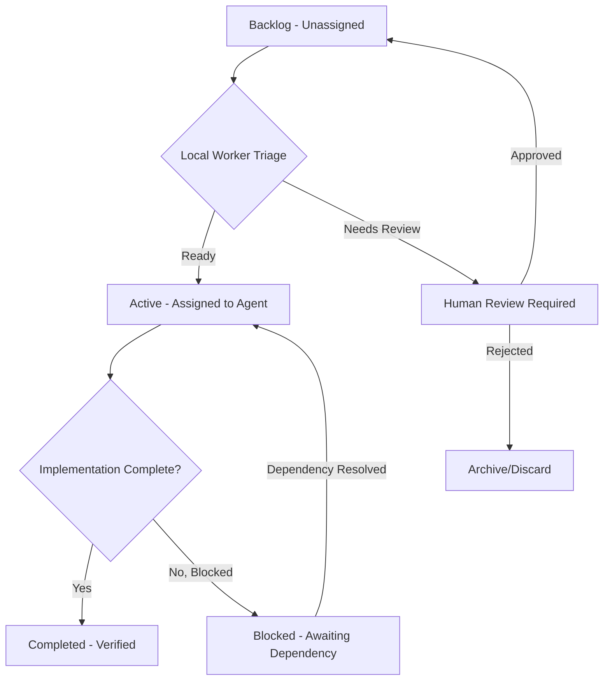

# 🎯 Master Triage Guide for Galaxy Game Agent Tasks

**Version**: 1.1  
**Last Updated**: 2026-06-08  
**Owner**: Senior Engineer / Team Lead

---

## 📚 Overview

This guide explains how to triage, assign, and manage tasks in the Galaxy Game project using our standardized task system. Follow this guide to ensure consistent task handling across all agents (local Ollama models, 0x/0.33x cloud agents).

**Key Principles**:
1. **Always start with backlog review** — never jump straight into active work without understanding dependencies
2. **Respect priority levels** — CRITICAL/HIGH tasks block lower-priority work
3. **Validate MVP alignment** — every task must tie to Luna settlement or core game mechanics
4. **Follow the triage workflow** — use Local Worker reports before handoff to cloud agents

---

## 🗂️ Task Folder Structure

### `backlog/`
**Purpose**: All approved but unassigned tasks, organized by date  
**Contents**: 
- New feature requests
- Refactoring work
- Technical debt cleanup
- Architecture decisions needing implementation
- Documentation gaps

**Naming Convention**:  
`YYYY-MM-DD-PRIORITY-TYPE-DESCRIBER.md`

Examples:
- `2026-05-31-HIGH-FEATURE-LUNA-SHORTAGE-DETECTION.md`
- `2026-06-01-MEDIUM-REFACTOR-ISRU-UNIT-INTEGRATION.md`
- `2026-05-29-LOW-DOCUMENTATION-WORLDHOUSE-SCHEMA.md`

### `active/`
**Purpose**: Tasks currently being worked on by agents  
**Contents**: 
- Tasks assigned to 0x/0.33x cloud agents
- Investigation tasks in progress
- Blocked tasks awaiting clarification

**Rules**:
- Maximum 5 active tasks per agent at once
- Must update status daily (or mark as blocked)
- Complete `Completion Report` section before moving to completed

### `completed/`
**Purpose**: Finished tasks with verified outcomes  
**Contents**: 
- Tasks with all acceptance criteria met
- Tests passing (RSpec, integration tests)
- Documentation updated if required

**Rules**:
- Must include completion report filled out
- Include commit message summary
- Link to related PR or commit hash if applicable

### `templates/`
**Purpose**: Standard task templates for consistency  
**Contents**: 
- `TASK_TEMPLATE.md` — Full task specification template
- `BACKLOG_ENTRY_TEMPLATE.md` — Quick backlog entry format
- `COMPLETION_REPORT_TEMPLATE.md` — Standardized completion documentation

---

## 🔄 Triage Workflow

### Step 1: Review Backlog (Local Worker - Ollama)

**Your Role**: You are a local worker (Ollama via Continue) with limited capabilities.

**What You CAN Do**:
- Read task files, docs, code files
- Analyze dependencies and gaps
- Create new task files in backlog
- Update existing task metadata
- Write to `Local Worker Triage Report` section

**What You CANNOT Do**:
- Run terminal commands (no git, docker, rspec)
- Execute code or tests
- Access database directly
- Fabricate command output

**Process**:
1. Read all tasks in `backlog/` for current date range
2. Check `Local Worker Triage Report` section:
   - Is template conformance correct?
   - Does MVP alignment make sense?
   - Are dependencies properly tracked?
3. Update status to `READY FOR CLOUD HANDOFF` when validation passes
4. Flag gaps in comments or create follow-up tasks

### Step 2: Assign to Cloud Agent (Human/Team Lead)

**Your Role**: Human supervisor or senior agent with full permissions.

**Process**:
1. Review local worker's triage report
2. Select appropriate cloud agent based on task complexity:
   - **0x agents**: Critical/High priority, complex architecture
   - **0.33x agents**: Medium priority, well-defined tasks
   - **1x agents**: Simple implementation tasks only (rare)
3. Move task file from `backlog/` to `active/`
4. Update `Agent Assignment` section with agent ID and supervision level

**Supervision Levels**:
- **Watched carefully**: 0x agents on critical tasks, all local models
- **Standard**: 0.33x agents on well-specified tasks
- **Autonomous OK**: Only for 1x agents (not recommended)

### Step 3: Implementation (Cloud Agent)

**Your Role**: Cloud-based agent with full environment access.

**Process**:
1. Read task file completely, including all sections
2. Verify dependencies are met (check blocked tasks)
3. Follow implementation steps exactly in order
4. Write code, run tests, update docs as needed
5. Fill out `Completion Report` section
6. Move task to `completed/` folder

### Step 4: Validation & Merge (Human/CI)

**Your Role**: CI pipeline or human reviewer.

**Process**:
1. Verify completion report is filled out
2. Check all acceptance criteria met
3. Run full test suite if code changes made
4. Merge PR and update project board

---

## 🎯 Priority Levels Explained

| Priority | When to Use | Examples |
|----------|-------------|----------|
| **CRITICAL** | Blocks MVP deployment, system-breaking issues | Missing core service files, failing production tests |
| **HIGH** | Core functionality for next milestone | ISRU production chain, Luna settlement mechanics |
| **MEDIUM** | Important but not blocking | Refactoring, documentation, test coverage improvements |
| **LOW** | Nice to have, can be deferred | Admin views, optional features, cleanup tasks |

**Rule**: Never start a MEDIUM/LOW task if CRITICAL/HIGH tasks are unassigned and blocking MVP.

---

## 📋 Task Types Breakdown

### `FEATURE`
New functionality implementation. Must include:
- Clear acceptance criteria
- Test coverage requirements
- Data fixtures if needed
- Integration points with existing systems

### `REFACTOR`
Code improvement without behavior change. Must include:
- Reason for refactoring (performance, clarity, tech debt)
- Before/after comparison
- Regression test strategy

### `ARCHITECTURE`
Design decisions, system analysis, gap audits. Must include:
- Impact assessment on MVP
- Dependencies identified
- Follow-up task breakdown

### `ANALYSIS`
Research, investigation, cost-benefit studies. Must include:
- Clear research questions
- Methodology used
- Conclusions and recommendations

### `DOCUMENTATION`
Docs updates, decision logs, guides. Must include:
- Link to affected code/features
- Who the audience is
- When to update next

---

## 🧩 Dependencies Management

Every task should explicitly state:

**Blocked by**: List of tasks that must complete first  
**Blocks**: List of tasks waiting on this one  

**Example**:
```markdown
**Blocked by**: 
- 2026-05-27-HIGH-REFACTOR-EXTRACT-ORBITAL-RESUPPLY-CYCLE.md

**Blocks**: 
- 2026-05-29-HIGH-FEATURE-LUNA-SHORTAGE-DETECTION-REQUESTS.md
```

**Rules**:
- Never start a task if "Blocked by" items are incomplete
- Update blocked tasks when you complete a dependency
- Use `INVESTIGATION-FINDINGS.md` for complex dependency analysis

---

## 🛑 Stop Conditions — When to Escalate

Escalate to human supervisor immediately if:

1. **Architecture violation**: Existing code violates DECISIONS.md rules
2. **Scope creep**: Task requires more than 4 sub-tasks to complete
3. **Undefined interfaces**: Missing service/models referenced in code
4. **MVP misalignment**: Task doesn't clearly support Luna settlement or core game loop
5. **Test failures**: Cannot get tests passing after reasonable attempts
6. **Data gaps**: No fixtures/data available for realistic testing

**Escalation Process**:
1. Add detailed notes to task file under "Issues Discovered"
2. Comment on issue/PR with specific blockers
3. Wait for human clarification before proceeding

---

## 📊 Status Workflow



---

## 🚀 Quick Start Checklist for New Agents

Before starting any task:

- [ ] Read `docs/new_agent/rules/DECISIONS.md` and `GUARDRAILS.md`
- [ ] Check if task file has `Local Worker Triage Report` filled out
- [ ] Verify all dependencies are complete or in progress
- [ ] Confirm you have appropriate permissions for task priority/type
- [ ] Understand MVP alignment — why does this matter for Luna settlement?
- [ ] Read related code files and services before implementing
- [ ] Plan test strategy before writing implementation code
- [ ] Follow template exactly — do not skip sections

---

## 📝 Example Task Flow

### Scenario: Implement ISRU Track A Service Tests

1. **Backlog Review (Local Worker)**:
   - Read `2026-05-18-HIGH-FEATURE-ISRU-TRACK-A-RSPEC-SUITE.md`
   - Check dependencies: Data fixtures task must complete first
   - Fill out triage report: "Template conformance PASS, MVP alignment VALID"

2. **Assignment (Human)**:
   - Move task to `active/`
   - Assign to 0x agent with "Watched carefully" supervision

3. **Implementation (Cloud Agent)**:
   - Create `spec/services/isru_track_a_spec.rb`
   - Use fixtures from completed data task
   - Run tests, fix failures, update completion report

4. **Completion (Human/CI)**:
   - Verify all tests pass
   - Move to `completed/` folder
   - Update project board

---

## 🔄 Maintenance & Hygiene

### Weekly Cleanup (Team Lead)
- Archive old completed tasks (> 30 days) into backup folder
- Review backlog for stale tasks (> 1 week unassigned)
- Update priority levels if MVP scope changed
- Remove duplicate or superseded tasks

### Monthly Audit
- Check alignment of all backlog tasks with current MVP goals
- Identify architectural gaps needing DECISIONS.md updates
- Review task completion rates and adjust agent assignments
- Update this guide based on lessons learned

---

## 📞 Contact & Support

**Questions about task format?** → Check `templates/TASK_TEMPLATE.md`  
**Unclear dependencies?** → Review `INVESTIGATION-FINDINGS.md`  
**Architecture concerns?** → Read `docs/new_agent/rules/DECISIONS.md`  
**Stuck on implementation?** → Escalate to human supervisor  

---

## ✅ Success Metrics

A well-run task system should have:
- **< 5 active tasks per agent** at any time
- **100% of tasks** with filled-out triage reports before assignment
- **< 24 hours** between task completion and move to `completed/`
- **Zero critical blockers** left unresolved > 48 hours
- **All MVP-aligned tasks** in backlog clearly marked

---

## 📚 Additional Resources

- [Task Template](./templates/TASK_TEMPLATE.md)
- [Agent Rules & Guardrails](../rules/GUARDRAILS.md)
- [Architecture Decisions Log](../rules/DECISIONS.md)
- [Project Overview](../../overview.md)

---

*This guide is living documentation. Update it as the system evolves.*